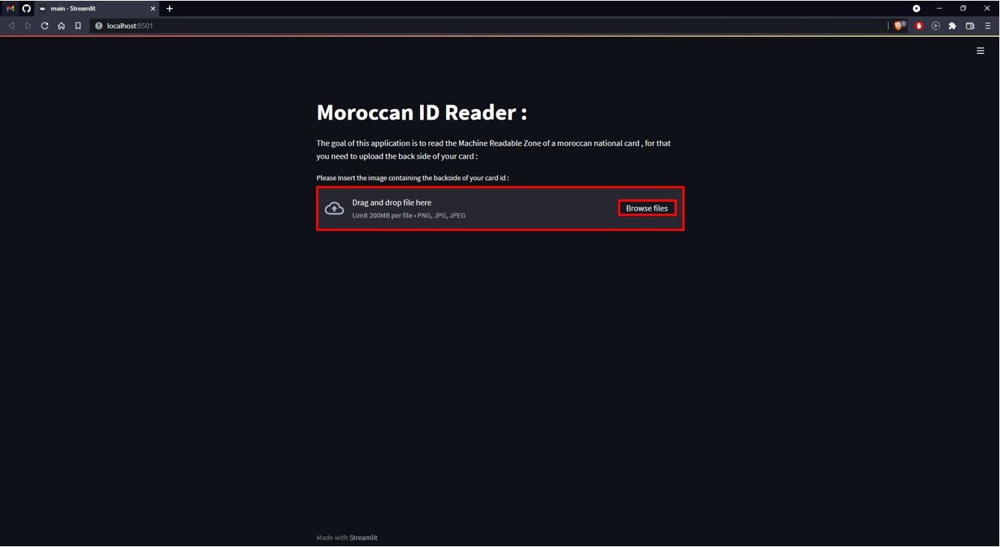
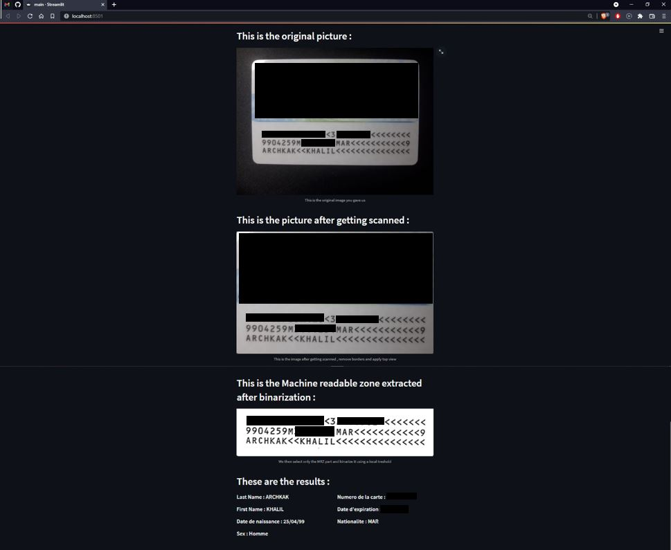

# Moroccan ID Reader

This application is made for extracting the MRZ (Machine Readable Zone).

MRZ or Machine Readable Zone is a particular area in an I.D. document (passport specifically) that encloses the document holder’s personal data. Generally, MRZ has two or three lines with the OCR (Optical character recognition) font text printed.

In our case this application will extract the following information from the Moroccan ID :

Last name , First name , Date of birth , Nationality , Expiration Date , Sex and the ID Number

This application was deployed using streamlit which is an open-source Python library that makes it easy to create and share beautiful, custom web apps for machine learning and data science.

# Utilization :

You can access the app from here : https://share.streamlit.io/khalilar42/moroccancardreader/main/main.py

After entering you just have to insert the back side (The side containing MRZ) of your Moroccan card ID using the form : 

#Conditions :

**Your image have to be of decent quality and with good lighting.**
MRZ (Machine Readable Zone)
**Your image should not be skewed the text have to be inline and horizantal.**

**Your image should be taken on a dark background to facilitate contour detection.**

# Result :

First your image will be scanned to detect contours and crop it , and the we will select only MRZ area and finaly display you all of the informations extracted as shown in the next picture : 

In the previous picture I hid sensitive Informations such as id number..etc, Dont worry you can see everything in your case , **check the last point for security part.**

# Last Point

According to streamlit documentation : 
https://docs.streamlit.io/knowledge-base/using-streamlitwhere-file-uploader-store-when-deleted

When you upload a file using **st.file_uploader** the data are copied to the Streamlit **backend via the browser, and contained in a BytesIO buffer in Python memory (i.e. RAM, not disk)**. **The data will persist in RAM until the Streamlit app re-runs from top-to-bottom**, which is on each widget interaction. **If you need to save the data that was uploaded between runs, then you can cache it so that Streamlit persists it across re-runs**.

**You can verify the code and be sure that i don't save the image in cache or any other place.**

# Ressources :

**https://muthu.co/all-tesseract-ocr-options/**
**https://www.pyimagesearch.com/2014/08/25/4-point-opencv-getperspective-transform-example/**
